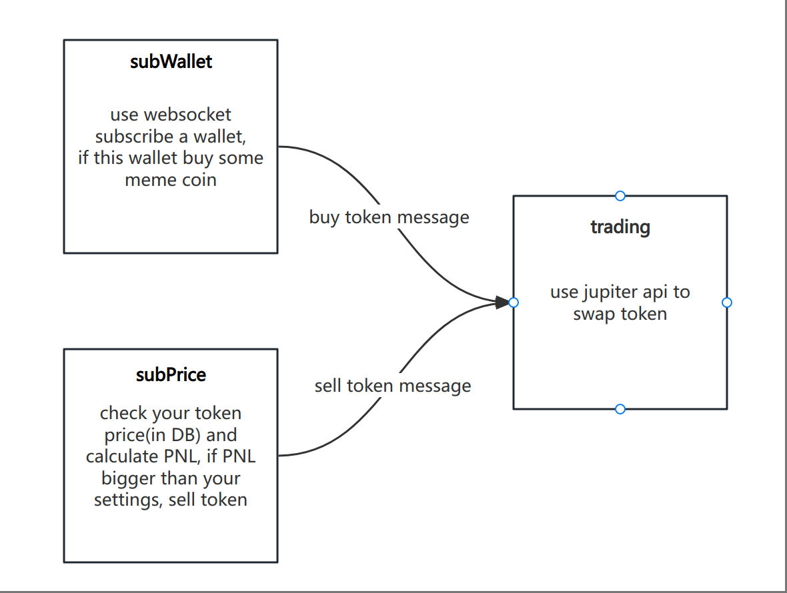

<p align="center">

</p>
<h1 align="center">Go Solana Bot</h1>

> A Solana auto trade bot power by GO🚀

## ⚠️ Disclaimer
Only for leaning

## 💻 Environment

- 🐁 Go 1.25+
- 📦 MySQL
- 📫 RocketMQ

## 🏃 How It Works


## ✨ Usage
- Create database and create table in MySQL
- Start RocketMQ and create Topic name `SubTopic` (or your setting)
- Edit config.yaml (read next chapter)
- Start Trading main.go
- Start SubWallet and SubPrice main.go
- PS: If you afraid auto trading, you can use swap_test.go buy or sell by hand

## ⚙️ Setting 
- Solana endpoint setting
    > Be careful, do not push your PrivateKey on github😄
    ```
    PublicKey: x # Your PublicKey
    PrivateKey: x # Your PrivateKey
    
    #SubscribeWallet: x
    SubscribeWallet: x,y,z # Who you want to subscribe
    
    # I suggest use helius or shyft endpoint, they has free plan for personal
    #RpcUrl: https://mainnet.helius-rpc.com/?api-key=x
    #WsUrl: wss://mainnet.helius-rpc.com/?api-key=x
    RpcUrl: https://rpc.shyft.to?api_key=x
    WsUrl: wss://rpc.shyft.to?api_key=x
    
    TransactionsUrl: https://api.helius.xyz/v0/transactions
    TransactionsApiKey: xxx
    STransactionsUrl: https://api.shyft.to/sol/v1/transaction/parsed
    STransactionsApiKey: xxx
    ```
- Trade setting
    ```
    UseJito: true
    JitoUrl: https://tokyo.mainnet.block-engine.jito.wtf/api/v1/transactions
    QuoteUrl: https://lite-api.jup.ag/swap/v1/quote
    PriceUrl: https://lite-api.jup.ag/price/v3
    OneBuyUsd: 0.2 # Ones buy Dollar, I use USDC to trade because easy to calculate 
    BuySlippage: 5 # Buy Slippage
    SellSlippage: 5 # Sell Slippage
    BuyPriorityFee: 0 # Not use yet
    SellPriorityFee: 0 # Not use yet
    SellRisePercent: 20 # If token in DB rise to this percent will auto sell
    SellFallPercent: 10 # If token in DB fall to this percent will auto sell
    ```
- Local setting
    ```
    MqUrl: 127.0.0.1:9876
    MqGroup: SubGroup
    MqTopic: SubTopic
    
    MySqlUrl: root:123456@tcp(127.0.0.1:3306)/solana_trade_bot?charset=utf8mb4&parseTime=True&loc=Local
    
    UseProxy: true # If you in Chain Main Land, you know
    ProxyUrl: http://127.0.0.1:10808
    ```

## 🙏 Thank To 
- solana-go [gagliardetto/solana-go](https://github.com/gagliardetto/solana-go)
- jupiter-go [ilkamo/jupiter-go](https://github.com/ilkamo/jupiter-go)
